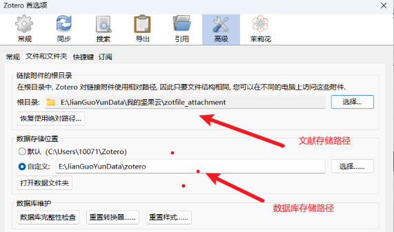
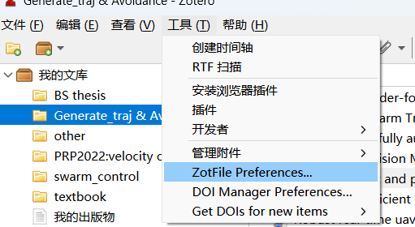
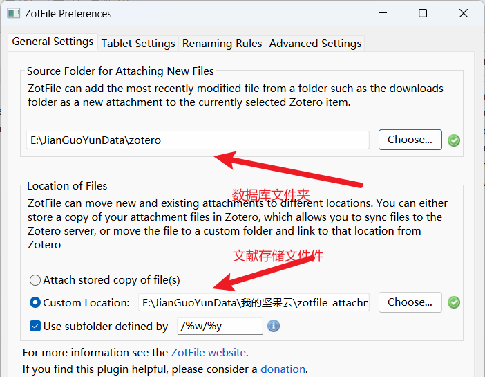

### 作用

文献管理软件

### 视频链接

https://www.bilibili.com/video/BV1o3411y7ob/?spm_id_from=333.999.0.0&vd_source=2792d8fd25d8291ad623c938db48e6c5

### 下载
官网 https://www.zotero.org/download/

### 配置
`文献存储路径`指的是zotero存放文献的地方

`数据库存储路径`指的是zotero软件存放数据的地方

### 插件
#### ZotFile
##### 配置
在`工具`->`ZoteFile Preferences`当中设置

修改下述两个文件存储路径

DOI Manager
Jasmium